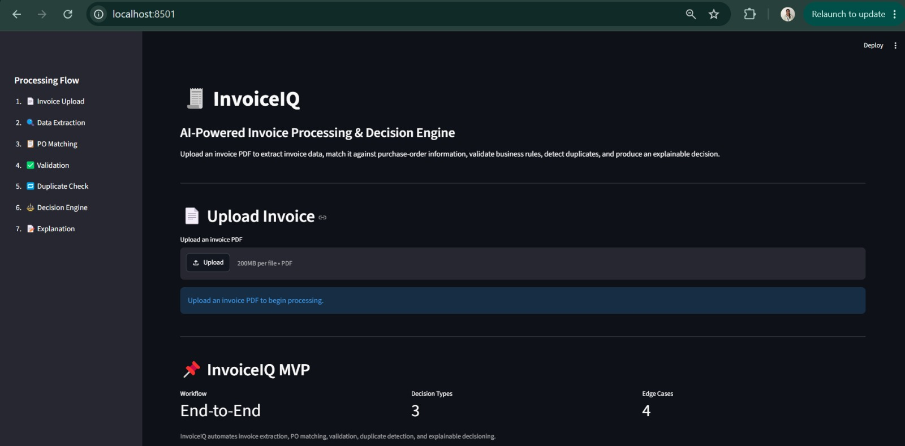
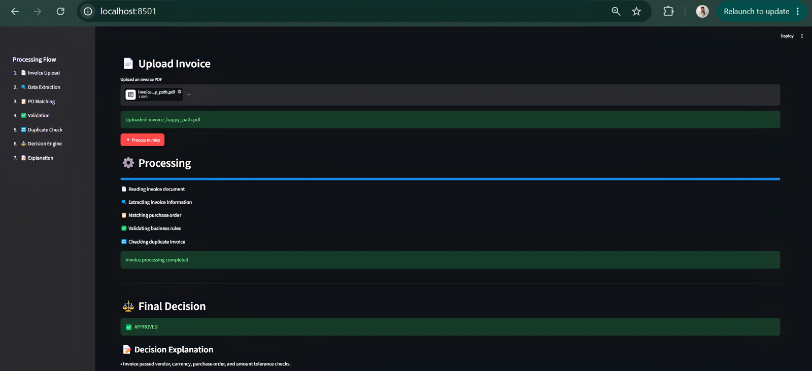
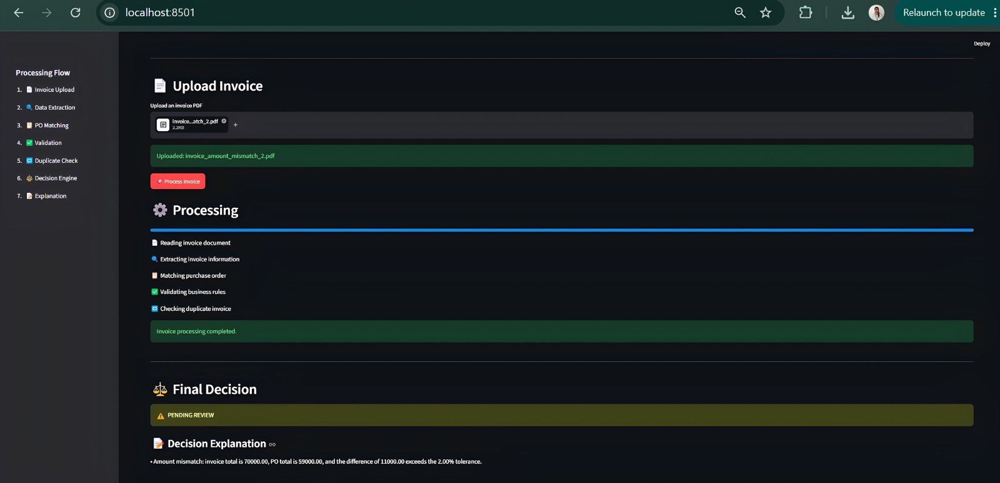
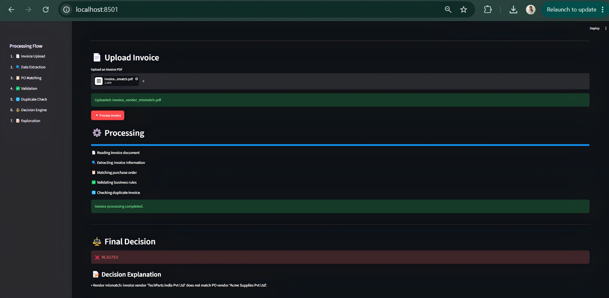
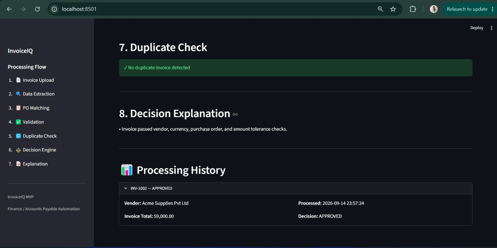

# 🧾 InvoiceIQ — AI-Powered Invoice Processing & Decision Engine

An automated Finance/AP workflow that extracts invoice data, validates it against purchase orders and business rules, detects duplicate invoices, and produces an explainable business decision.

**Decision Outcomes:** 🟢 APPROVED · 🟡 PENDING REVIEW · 🔴 REJECTED

[🚀 Live Demo — Try InvoiceIQ](https://invoiceiq-l7zpq4rf4ofmbjjn7b6thc.streamlit.app)

---

## 🚀 Project Overview

InvoiceIQ transforms an invoice PDF into a structured, explainable decision through an end-to-end automated workflow.

**Invoice PDF → Extraction / OCR → Validation → PO Matching → Duplicate Check → Business Rules → Decision → Explanation**

The system is designed to reduce manual Accounts Payable processing while keeping financial decisions deterministic, transparent, and reviewable.
---

## 📸 Application Preview

### Invoice Upload



The Streamlit interface allows users to upload an invoice PDF and start the automated processing workflow.

### Approved Invoice



A valid invoice that passes the required validation, PO matching, duplicate, vendor, currency, and amount checks is automatically approved.

### Pending Review



Invoices requiring human attention, such as amount mismatches outside the configured tolerance or missing PO information, are routed to review.

### Rejected Invoice



Invoices with conditions such as duplicate processing or vendor mismatch are rejected with an explanation.

### Processing History

 

---

## 🎯 The Problem This Solves

Accounts Payable teams receive invoices in different formats, including machine-readable and scanned PDFs.

Manual invoice processing requires teams to:

- Extract invoice information
- Identify and validate the vendor
- Find and match the purchase order
- Compare invoice and PO amounts
- Validate required fields
- Detect duplicate invoices
- Apply business rules
- Decide whether an invoice should be approved or reviewed

These activities can become repetitive, time-consuming, and error-prone as invoice volumes increase.

**InvoiceIQ automates this workflow while keeping the final financial decision explainable and rule-driven.** 
---

## 🏗️ System Architecture

```text
                    ┌─────────────────────┐
                    │     Invoice PDF     │
                    └──────────┬──────────┘
                               │
                               ▼
                    ┌─────────────────────┐
                    │  PDF Text / OCR     │
                    │     Extraction      │
                    └──────────┬──────────┘
                               │
                               ▼
                    ┌─────────────────────┐
                    │ Invoice Data        │
                    │ Normalization        │
                    └──────────┬──────────┘
                               │
                               ▼
             ┌─────────────────────────────────┐
             │       Validation Layer          │
             │ Required fields / data checks   │
             └───────────────┬─────────────────┘
                             │
                             ▼
                    ┌─────────────────────┐
                    │    PO Matching      │
                    │ Vendor / Amount     │
                    └──────────┬──────────┘
                               │
                               ▼
                    ┌─────────────────────┐
                    │ Duplicate Detection │
                    └──────────┬──────────┘
                               │
                               ▼
                    ┌─────────────────────┐
                    │  Decision Engine    │
                    │ Business Rules      │
                    └──────────┬──────────┘
                               │
                ┌──────────────┼──────────────┐
                ▼              ▼              ▼
           🟢 APPROVED   🟡 PENDING REVIEW   🔴 REJECTED
                               │
                               ▼
                    ┌─────────────────────┐
                    │ Explanation & UI    │
                    └─────────────────────┘
---

## 🛠️ Tech Stack

| Technology | Purpose |
|---|---|
| **Python** | Core application and business logic |
| **Streamlit** | Interactive web interface |
| **PyMuPDF** | PDF text extraction |
| **Tesseract OCR** | Scanned/image invoice processing |
| **Pydantic** | Invoice data validation |
| **Pandas** | Purchase-order data handling |
| **SQLite** | Processing and duplicate tracking |
| **PyYAML** | Configurable business rules |
| **Pytest** | Testing the processing pipeline |

### Why this stack?

The stack was intentionally kept lightweight so the complete invoice-processing workflow can run locally without requiring a complex infrastructure setup.
---

## 📁 Project Structure

```text
invoiceiq/
│
├── app.py
├── requirements.txt
├── packages.txt
├── README.md
├── .env.example
├── .gitignore
│
├── config/
│   └── rules.yaml
│
├── data/
│   └── po/
│       └── purchase_orders.csv
│
├── src/
│   ├── extraction/
│   │   ├── pdf_extractor.py
│   │   ├── ocr_extractor.py
│   │   └── invoice_extractor.py
│   │
│   ├── matching/
│   │   └── po_matcher.py
│   │
│   ├── validation/
│   │   └── validator.py
│   │
│   ├── decision/
│   │   └── decision_engine.py
│   │
│   ├── storage/
│   │   └── database.py
│   │
│   └── pipeline.py
│
└── tests/
---

## ▶️ How to Run Locally

### 1. Clone the repository

```bash
git clone https://github.com/SANGAMI-1410/invoiceiq.git
cd invoiceiq 
---

## ⚖️ Decision Logic

InvoiceIQ uses deterministic business rules to classify every processed invoice.

| Condition | Decision |
|---|---|
| Required information missing | 🟡 PENDING REVIEW |
| No PO provided | 🟡 PENDING REVIEW |
| Vendor does not match PO | 🔴 REJECTED |
| Currency does not match | 🔴 REJECTED |
| Duplicate invoice detected | 🔴 REJECTED |
| Invoice amount outside configured PO tolerance | 🟡 PENDING REVIEW |
| All validation and matching checks pass | 🟢 APPROVED |

### Current Configuration

- **Amount tolerance:** ±2% of the PO amount
- **Required fields:** Vendor, Invoice Number, Invoice Date, Total
- **Duplicate key:** Vendor + Invoice Number
- **Uncertain cases:** Routed to human review instead of being automatically rejected

This approach keeps financial decisioning predictable, auditable, and explainable.
---

## 🧪 Demo Scenarios & Results

InvoiceIQ was tested against multiple realistic invoice-processing scenarios.

| Scenario | Expected Outcome | Result |
|---|---|---|
| Valid invoice with matching PO | APPROVED | ✅ PASS |
| Invoice amount outside PO tolerance | PENDING REVIEW | ✅ PASS |
| Vendor mismatch | REJECTED | ✅ PASS |
| Duplicate invoice | REJECTED | ✅ PASS |
| Scanned/image-based invoice | OCR extraction fallback | ✅ Supported |

### Scenario 1 — Valid Invoice

A valid invoice matching the corresponding purchase order and satisfying all configured business rules is automatically approved.

**Result:** 🟢 `APPROVED`

### Scenario 2 — Amount Mismatch

When the invoice amount differs from the purchase order beyond the configured tolerance, the invoice is routed for human review.

**Result:** 🟡 `PENDING REVIEW`

### Scenario 3 — Vendor Mismatch

If the invoice vendor does not match the vendor associated with the purchase order, the invoice is rejected.

**Result:** 🔴 `REJECTED`

### Scenario 4 — Duplicate Invoice

If the same vendor and invoice number are processed again, InvoiceIQ detects the duplicate and rejects it.

**Result:** 🔴 `REJECTED`

### Scenario 5 — Scanned Invoice

For image-based or scanned PDFs where normal text extraction is insufficient, InvoiceIQ uses Tesseract OCR as a fallback extraction path.
---

## 🔄 Processing Stages

Each invoice moves through a visible sequence of processing stages:

1. **📄 Invoice Upload**  
   The user uploads an invoice PDF through the Streamlit interface.

2. **🔍 Data Extraction**  
   Invoice information such as vendor, invoice number, date, PO number, tax, and total is extracted from the document.

3. **📝 OCR Fallback**  
   If the PDF is scanned or image-based, Tesseract OCR is used to extract readable text.

4. **📋 PO Matching**  
   The extracted purchase-order reference is matched against the available purchase-order data.

5. **✅ Validation**  
   Required fields, vendor information, currency, and invoice data are validated.

6. **🔁 Duplicate Detection**  
   Previously processed invoices are checked using the configured duplicate key.

7. **⚖️ Decision Engine**  
   Deterministic business rules classify the invoice as:
   
   - 🟢 APPROVED
   - 🟡 PENDING REVIEW
   - 🔴 REJECTED

8. **📝 Explanation**  
   The final decision is displayed together with the reasons behind it.
---

## 📋 Example Purchase Order Data

InvoiceIQ uses purchase-order information to validate invoices and perform matching checks.

The current demo dataset contains approved purchase orders such as:

| PO Number | Vendor | Currency | PO Amount | Status |
|---|---|---|---:|---|
| PO-1001 | Acme Supplies Pvt Ltd | INR | ₹59,000 | APPROVED |
| PO-1002 | TechParts India Pvt Ltd | INR | ₹1,00,000 | APPROVED |
| PO-1003 | Global Office Solutions | INR | ₹75,000 | APPROVED |

The purchase-order data is stored separately from the processing logic, allowing the dataset to be replaced or extended without changing the decision engine.
---

## 🧠 What I Learned

Building InvoiceIQ reinforced several important engineering principles:

- **Separate extraction from decisioning** — extracting information from documents and deciding what to do with that information are different problems.
- **Keep financial rules deterministic** — approval decisions should be based on explicit, testable business rules.
- **Design for uncertainty** — when information cannot be safely validated, routing the invoice to human review is safer than making an incorrect automated decision.
- **OCR is an important fallback** — real-world invoice documents are not always machine-readable.
- **Explainability matters** — an automated decision is more useful when users can understand why it was made.
- **Edge cases should be designed intentionally** — duplicate invoices, vendor mismatches, missing POs, and amount mismatches are part of the workflow rather than afterthoughts.
---

## 🚀 Future Improvements

The current MVP focuses on delivering a reliable end-to-end invoice-processing workflow. Potential extensions include:

- Integrating with real ERP or procurement systems
- Supporting additional invoice formats and languages
- Adding confidence scores for extracted fields
- Introducing human-in-the-loop review actions
- Adding a persistent analytics dashboard for processing history
- Supporting email-based invoice ingestion
- Adding role-based access and authentication
- Deploying the application as a production service
- Expanding automated test coverage with a larger invoice dataset
---

## 📌 Project Summary

**InvoiceIQ** demonstrates how an operational Finance/AP workflow can be converted into a reliable automated decision pipeline.

It combines:

**Document Processing → OCR → Data Validation → PO Matching → Duplicate Detection → Business Rules → Explainable Decisioning**

The project prioritizes:

- ✅ Working end-to-end automation
- ✅ Deterministic financial decisioning
- ✅ Realistic edge-case handling
- ✅ Explainable outcomes
- ✅ Modular and testable architecture
- ✅ Simple, intuitive user interface

> Built as an AI/ML engineering project focused on solving a real operational problem with practical automation.